.. include:: <s5defs.txt>

=========================
Android主题演讲
=========================
.. class:: orange huge

    * Android版本简介
    * Android UI
    * Android ROM

Android诞生
========================
Android一词最先出现在科幻小说《未来夏娃》中，作者将外表像人类的机器起名为Android。

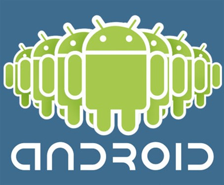

2007年11月5日这天，谷歌公司正式向外界展示了这款名为Android的操作系统。

Android 1.0
=======================
2008年9月，谷歌正式发布了Android 1.0系统。代表机型HTC Dream（G1）。

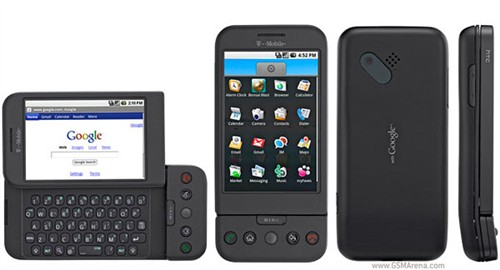

.. class:: small orange

T-Mobile G1是世界上第一款使用Android操作系统的手机。

Android 1.5
========================
Cupcake（纸杯蛋糕），代表机型HTC Magic（G2）

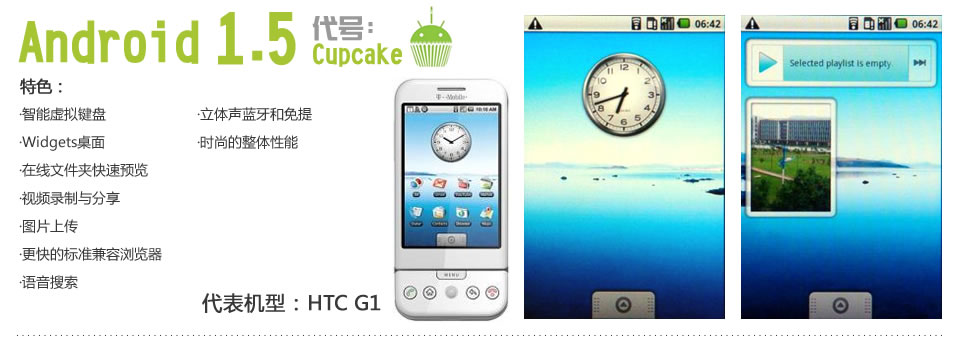

.. class:: small orange

    从Android 1.5版本开始，谷歌开始将Android的版本以甜品的名字命名。

Android 1.6
========================
Donut（甜甜圈），代表机型HTC Hero(G3)

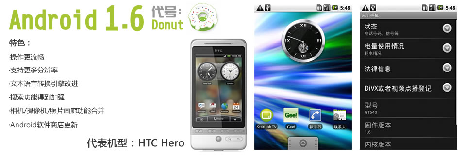

Android 2.0
========================
Eclair（松饼），代表机型Motorola ME600

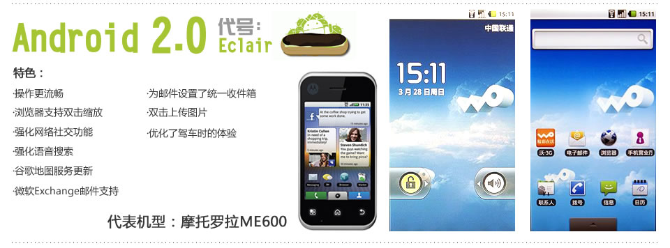

Android 2.1
========================
Eclair（松饼），代表机型NEXUS One（G5）

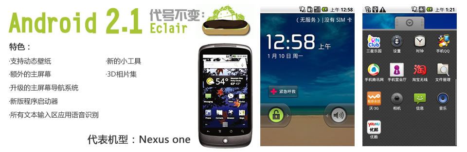

Android 2.2
===========================
Froyo（冻酸奶），代表机型HTC Desire HD(G10)，SAMSUNG Galaxy S

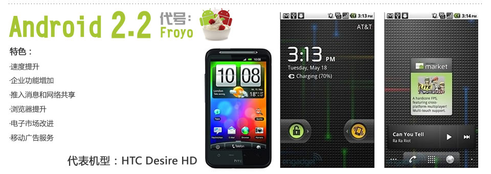

.. class:: small orange

2010年2月，Android的驱动程序从Linux内核状态树上除去，Android与Linux开发主流将分道扬镳。

Android 2.3
===========================
Gingerbread (姜饼），代表机型三星GALAXY SII，HTC Sensation(G14)，Nexus S

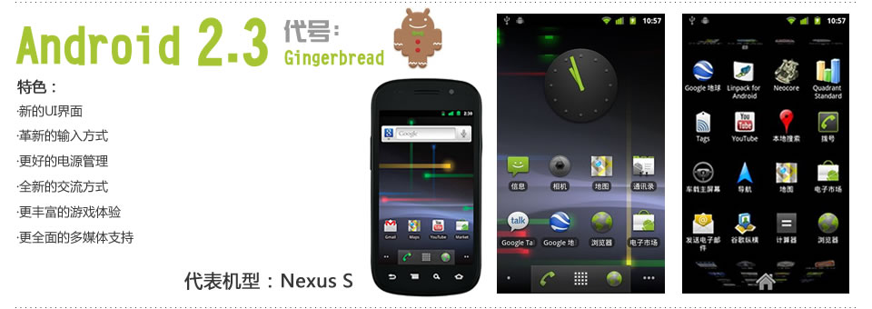

Android 3.0
===========================
Honercomb（蜂巢），专用于平板。

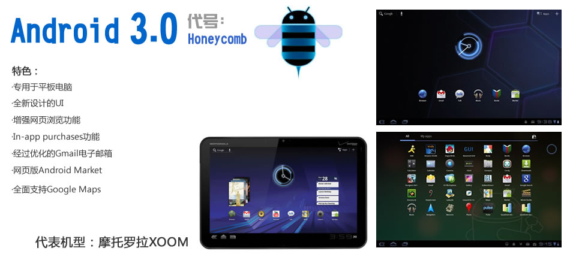

Android 4.0
===========================
Ice Cream Sandwich（冰激凌三明治），代表机型GALAXY Nexus

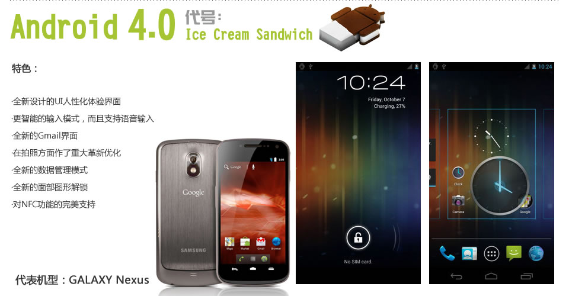

Android UI
==============================
Android :orange:`{UI/界面/桌面/Launcher}`

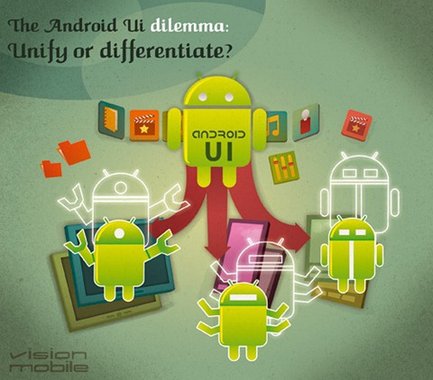

.. class:: small orange 

Launcher俗称HomeScreen，也就是我们启动Android手机，第一眼看到的应用程序。

民间第三方Android Lanucher
===============================

.. class:: orange

    * ADW Launcher
    * Launcher Pro
    * GO Launcher 

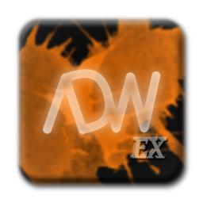

国际手机厂商Android Lanucher
===============================
.. class:: orange huge

    - Motoblur
    - HTC Sense
    - Samsung TouchWiz
    - Sony Ericsson Rachael

.. image:: images/samsung_logo.jpg
        :width: 200px

Samsung TouchWiz
===================
Samsung’s TouchWiz is used not only for Android devices, but also internally developed systems and their **bada operating system**.

.. image:: images/samsung_logo.jpg

Motoblur
=================
Motoblur, sometimes written as MOTOBLUR, is Motorola’s customized Android interface. It has a heavy emphasis placed on social networking activities.

HTC Sense
==================
HTC phones come with an interface named “Sense”.  It is based off of the company’s TouchFLO 3D user interface.

“a design experience, an architecture that is all about how people use the device, making their content personal to how they use the device.”

Sony Ericsson Rachael
======================
大家习惯叫其Rachael界面，索爱自定义界面正式命名应该是Nexus。Nexus界面包括索爱招牌式的Timescape应用程序。

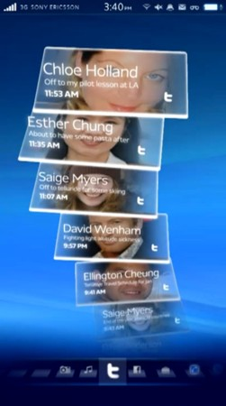
   

战略问题-四个屏幕的战争
========================================== 
UI的战斗将蔓延到你的整个生活——不止是手机，还要加上电视，电脑，平板。由多屏幕组成的“用户体验生态系统”（Experience Ecosystem），能让用户把操作经验和习惯轻松地由一个屏幕过渡到另外一个屏幕。

.. class:: right

`Android UI 之困境：统一还是分化`__

__ http://www.moandroid.com/?p=2039

Android系统二次开发
====================
Android :orange:`{ROM/刷机包/二次开发/深度二次定制}`

Android足够的开放性让很多开发者投身到第三方ROM的开发中，相比Google提供的标准Android ROM，摩托罗拉、HTC、三星这些手机厂商在自己的产品中会进行大量的改进以融入自身特色形成特殊的用户体验，而第三方ROM开发团队会要求自己比所有手机厂商做得更好。

国际手机厂商对Android的定制
==============================================

.. class:: huge orange

    * HTC
    * SAMSUNG
    * MOTOROLA

国内厂商对Android的定制-Android衍生系统
==============================================

.. class:: huge orange

    * OPhone（中国移动）
    * 阿里云OS（阿里巴巴）
    * 乐Phone（联想）
    * 百度易（百度）
    * 中兴/华为
    * 魅族/OPPO/步步高/酷派

OPhone
=========
中移动和播思通讯自2008年开始在谷歌Android操作系统基础上，主导开发了OPhone系统，该系统直接内置了中移动的服务菜单、音乐随身听、手机导航、号簿管家、139邮箱、飞信、快讯和移动梦网等特色业务。

代表机型：Moto MT620

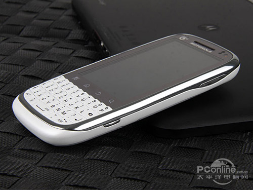

阿里云OS
===============================
与其它手机操作系统不同的是，云智能OS采用Cloud App方式，使用户不需要在手机端下载应用，而只在网络环境下，登陆统一的云账号后，即可运行OS平台上的各种应用。

阿里云OS并非如外界所言系基于Android的二次开发，其系统程序中包含阿里云自行设计的虚拟机、云服务资源库、云应用运行框架和界面框架以及上层应用，并将全面兼容Android应用程序。

阿里云OS-天语W700
==================

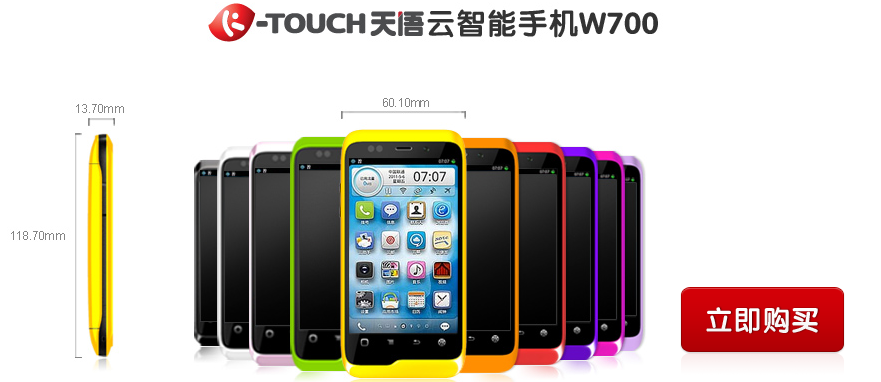

乐Phone
=========
联想推出的跨越Windows和Android两个平台的操作系统，英文名为LeOS。该系统是一个来自基于Linux内核的Android的操作系统，给终端用户的操作界面将是统一的。

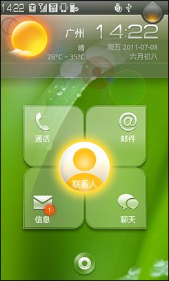

技术性问题-这些OS到底是不是Android系统
========================================

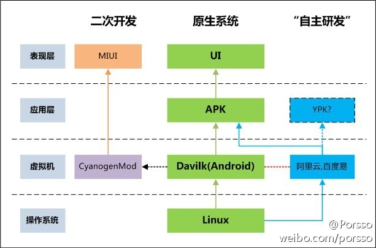

`自主研发的百度易阿里云和MIUI与Android的关系`__

__ http://bbs.xiaomi.com/thread-182634-1-1.html

技术性问题-这些OS到底是不是Android系统
========================================

阿里云OS是一个兼容Android系统，或者说是“类Android”、“山寨Android”系统，这种兼容系统不是没有先例的。Linux就是一个著名的兼容Unix操作系统。 

`阿里云OS和android的真实关系`__

__ http://www.angeeks.com/viewthread.php?tid=1080211

轻量级新锐势力
===============================
.. class:: huge orange

- CyanogenMod（国外）
- MIUI
- 点心OS
- 乐蛙 
- 众多创业公司
- 众多业余爱好者

CyanogenMod
===============================
CyanogenMod is an aftermarket firmware for a number of cell phones based on the open-source Android operating system. It offers features not found in the official Android based firmwares of vendors of these cell phones.

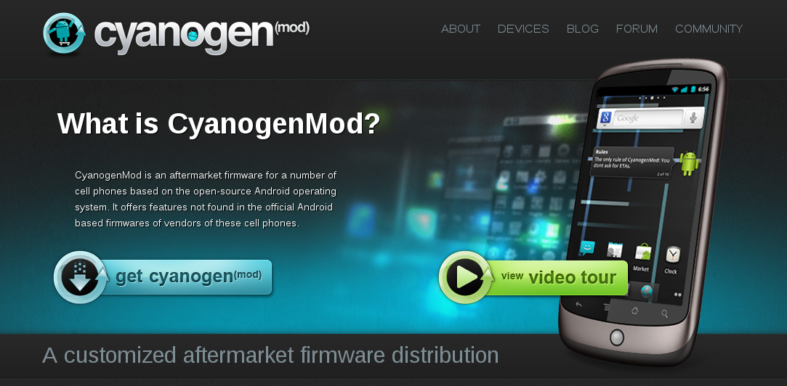

MIUI & 小米OS
====================
MIUI是一个基于CyanogenMod进行二次修改的衍生项目，MIUI已经成为国内最大的第三方Android ROM。

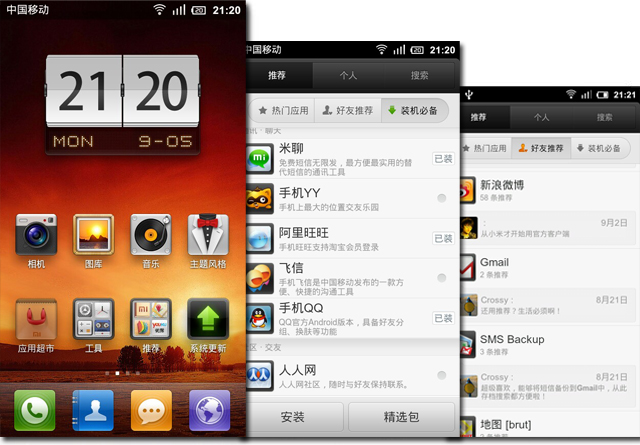

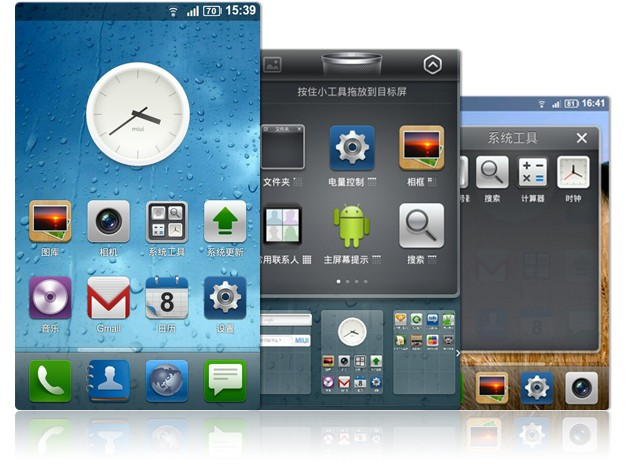

小米手机
========

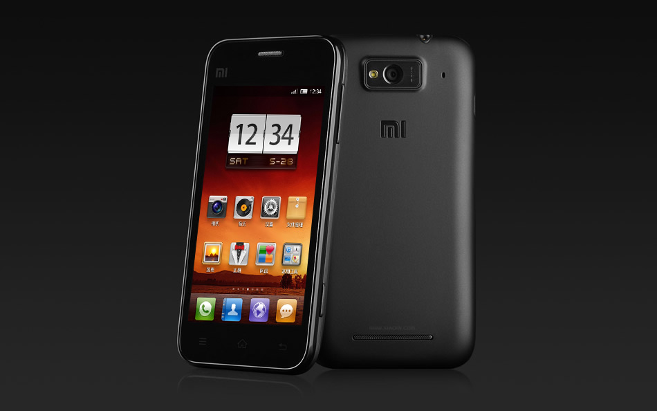

点心OS & 点心
==================
点心专注于提供移动互联网智能终端整体解决方案，致力于打造最纯正的Android系统，最专业的操作系统解决方案。

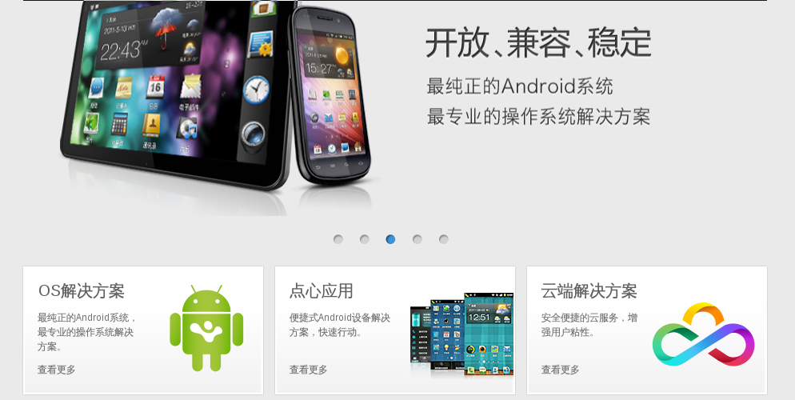

点心OS手机-夏普SH7218U
=========================
该机搭载的是基于Android的点心OS。

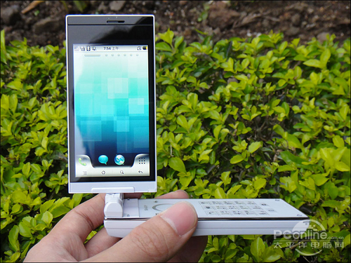

乐蛙
===================
乐蛙专注于为千元安卓手机提供最有价值的本地化Android OS。

乐蛙ROM & 乐蛙
===================
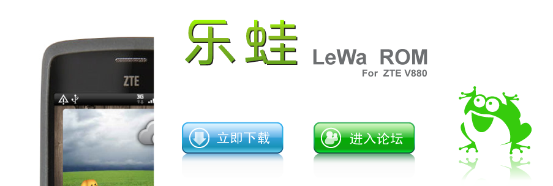

中兴V880全称ZTE-U V880，也叫Blade（刀锋），包括英国的Orange定制橘子版，以及中国联通定制的国内版。

刷机包制作爱好者
===================
如何去制作一个系统ROM，把自己喜欢的应用、讨厌的服务等等都体现在ROM文件中，对系统的内核进行编译使其达到最优，或供数以万计的用户下来来刷机。而这种类型的系统ROM其实是底层高深的高手才能做到的事情。

.. class:: right

`专访Xdan：国内Android系统民间ROM制作第一人`__

__ http://it.sohu.com/20100906/n274745854.shtml

刷机包哪里找？
===============
各种论坛，一般都是刷机包聚集的地方。

我常上的论坛： `XDA论坛`__ `5iROM`__

__ http://bbs.xda.cn/forum.php

__ http://www.5irom.com/forum.php

其它有名的论坛： `机锋论坛`__ `N多网`__

__ http://bbs.gfan.com/

__ http://www.nduoa.com/

技术问题-刷机包/ROM/衍生系统
=========================================
:orange:`刷机包制作：` 基本上不涉及到源代码，个人就可以入手

:orange:`ROM：` 需要了解一些Android系统原理，对系统有一定的修改/优化

:orange:`xxOS:` 深入了解Android系统原理，进行二次开发/深度定制

回顾历史
=========================
.. container:: handout

    雨林木风， 曾被业界称为“三大XP盗版集团”之一，与番茄花园齐名。

    三大XP盗版集团：番茄花园、雨林木风、深度

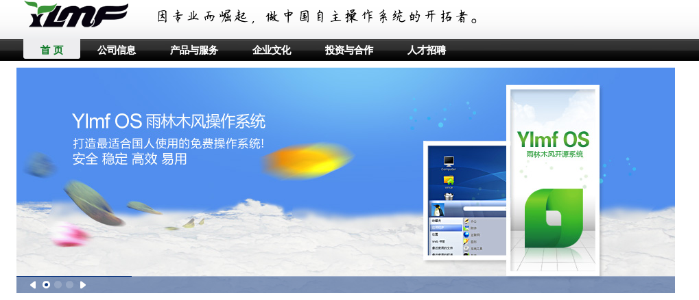

现在未来
==========
“对计算机专业的同学们来说，今天是你们最好的创业时机，是最适合你们的创业时机。”

“这个机会，我可以保证，绝对比1999年的更大，也许大五倍，也许大十倍，或者五十倍，具体大多少我不好说，但是我肯定，绝对比当年丁磊马云的机会要大很多。”

.. class:: right

`创新工场2012浙大招聘宣讲会-李开复`__

__ http://zhichang.umiwi.com/2011/1021/44282.shtml

Android其它
=============
.. class:: huge orange

    * Android APP开发
    * Android系统原理
    * Android体系架构
